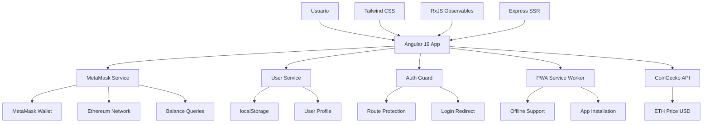

# 🚀 PIB Web Payment Rural - CryptoPay

<div align="center">


**Aplicación de Pagos Móviles con Integración Web3 Completa y Diseño Futurista**

[� Demo](#demo) • [📋 Características](#características) • [🛠️ Instalación](#instalación) • [📖 Documentación](#documentación)

</div>

---

## 📋 Tabla de Contenidos

- [🎯 Descripción del Proyecto](#-descripción-del-proyecto)
- [✨ Características Principales](#-características-principales)
- [🏗️ Arquitectura del Sistema](#️-arquitectura-del-sistema)
- [�️* Stack Tecnológico Completo](#️-stack-tecnológico-completo)
- [�* Instalación y Configuración](#-instalación-y-configuración)
- [� *Funcionalidades Implementadas](#-funcionalidades-implementadas)
- [🎨 Diseño y UX](#-diseño-y-ux)
- [🔐 Seguridad](#-seguridad)
- [📊 Estructura del Proyecto](#-estructura-del-proyecto)
- [🧪 Testing](#-testing)
- [📈 Rendimiento](#-rendimiento)
- [🔮 Roadmap](#-roadmap)
- [👥 Contribución](#-contribución)
- [📄 Licencia](#-licencia)

---

## 🎯 Descripción del Proyecto

**PIB Web Payment Rural - CryptoPay** es una aplicación web progresiva (PWA) de última generación desarrollada con Angular 19 que revoluciona los pagos digitales combinando tecnología blockchain con una experiencia de usuario excepcional. La aplicación permite a usuarios rurales y urbanos realizar transacciones financieras de manera segura, intuitiva y moderna con integración completa de MetaMask y precios en tiempo real.

### 🌟 Características Destacadas

- 🔗 **Integración MetaMask Real**: Conexión directa con wallets Web3 y balance ETH en tiempo real
- 🎨 **Diseño Futurista**: UI/UX moderna con efectos glassmorphism y animaciones avanzadas
- 📱 **PWA Completa**: Aplicación instalable con capacidades nativas
- 🔒 **Seguridad Avanzada**: Guards de autenticación y protección de rutas
- ⚡ **SSR Habilitado**: Server-Side Rendering para rendimiento óptimo
- 💰 **Precios en Tiempo Real**: Integración con CoinGecko API para conversión USD
- 🌐 **Experiencia Mobile-First**: Optimizado para dispositivos móviles

---

## ✨ Características Principales

### 🔐 Sistema de Autenticación Web3 Completo
- ✅ **Login Futurista**: Interfaz moderna con efectos glassmorphism
- ✅ **Conexión MetaMask**: Integración directa y automática
- ✅ **Balance ETH Real**: Consulta de balance en tiempo real desde la blockchain
- ✅ **Conversión USD**: Precio actual de ETH via CoinGecko API
- ✅ **Detección de Red**: Identificación automática de la red Ethereum
- ✅ **Persistencia de Sesión**: Reconexión automática al recargar

### 👤 Gestión de Usuario Avanzada
- ✅ **Perfil Completo**: Datos personales editables con validaciones
- ✅ **Avatar Dinámico**: Cambio aleatorio o upload personalizado
- ✅ **Configuraciones de Privacidad**: Control de visibilidad de datos
- ✅ **Persistencia Local**: Almacenamiento seguro en localStorage
- ✅ **Estados Reactivos**: Actualización en tiempo real con RxJS

### 💰 Dashboard Financiero Avanzado
- ✅ **Balance ETH**: Visualización en tiempo real con actualización manual
- ✅ **Conversión Automática**: Equivalente en USD actualizado
- ✅ **Historial de Transacciones**: Simulación de actividad reciente
- ✅ **Notificaciones Interactivas**: Sistema completo de notificaciones
- ✅ **Indicadores Visuales**: Estados de conexión y transacciones

### �  Aplicación PWA Completa
- ✅ **Manifest Configurado**: Instalable en dispositivos móviles
- ✅ **Service Worker**: Capacidades offline (implementado)
- ✅ **Shortcuts**: Accesos rápidos a funciones principales
- ✅ **Iconos Adaptativos**: Soporte para diferentes tamaños de pantalla
- ✅ **Tema Personalizado**: Colores y branding consistente

### 🎨 Experiencia de Usuario Premium
- ✅ **Animaciones Suaves**: Transiciones y efectos visuales
- ✅ **Haptic Feedback**: Vibración en dispositivos móviles
- ✅ **Estados de Carga**: Feedback visual durante operaciones
- ✅ **Diseño Responsive**: Adaptable a todas las pantallas
- ✅ **Navegación Intuitiva**: Bottom navigation con efectos glassmorphism

---

## 🏗️ Arquitectura del Sistema



### 🔧 Componentes Principales

| Componente | Descripción | Responsabilidad |
|------------|-------------|-----------------|
| **Login** | Autenticación Web3 | Conexión MetaMask, validación de wallet |
| **Dashboard (Inicio)** | Pantalla principal | Balance ETH/USD, transacciones, navegación |
| **Perfil** | Gestión de usuario | Datos personales, avatar, configuraciones |
| **Editar Perfil** | Editor de datos | Formulario completo con validaciones |
| **Historial** | Transacciones | Lista de actividad y movimientos |
| **Pagar** | Sistema de pagos | Interfaz de envío de dinero |
| **Contactos** | Gestión de contactos | Lista de destinatarios frecuentes |
| **Mi QR** | Código QR personal | Generación y visualización de QR |
| **Guards** | Protección de rutas | Autorización y redirección automática |
| **Services** | Lógica de negocio | Estado global, API calls, persistencia |

---

## 🛠️ Stack Tecnológico Completo

### 🎯 Frontend Framework
 **Angular 19.2.0**
- Standalone Components para mejor tree-shaking
- Server-Side Rendering (SSR) habilitado
- Signals y Control Flow moderno
- Lazy Loading de rutas

### 💻 Lenguajes y Tipado
 **TypeScript 5.7.2**
- Configuración estricta habilitada
- Interfaces personalizadas para Web3
- Decoradores experimentales
- Módulos ES2022

### 🎨 Estilos y Diseño
 **Tailwind CSS 4.1.13**
- Utility-first CSS framework
- Animaciones personalizadas (float, glow, pulse)
- Efectos glassmorphism y backdrop-blur
- Colores crypto personalizados
- Responsive design mobile-first

### 🔗 Blockchain & Web3
 **MetaMask Integration**
- Conexión directa con Ethereum wallet
- Consultas de balance en tiempo real
- Detección de red automática
- Manejo de errores robusto

 **Ethereum Network**
- Soporte para Mainnet y Testnets
- Consultas eth_getBalance
- Conversión Wei a ETH
- Validación de direcciones

### 📊 Estado y Reactividad
 **RxJS 7.8.1**
- BehaviorSubjects para estado global
- Observables para datos reactivos
- Operadores map, filter, switchMap
- Manejo de errores con catchError

### 🌐 APIs Externas
 **CoinGecko API**
- Precios de ETH en tiempo real
- Conversión automática a USD
- Rate limiting y error handling
- Cache de precios

### 📱 PWA y Capacidades Nativas
 **Progressive Web App**
- Manifest.json configurado
- Service Worker implementado
- Instalación en dispositivos móviles
- Shortcuts y iconos adaptativos

### 🚀 Server-Side Rendering
 **Angular Universal**
- Renderizado del lado del servidor
- Mejor SEO y performance
- Hydration automática
- Express.js como servidor

 **Express.js 4.18.2**
- Servidor HTTP para SSR
- Middleware personalizado
- Compresión y optimización
- Manejo de rutas estáticas

### 🛠️ Herramientas de Desarrollo


### 🧪 Testing Framework


---

## 🚀 Instalación y Configuración

### 📋 Prerrequisitos

-  **Node.js 20.x o superior**
-  **npm 10.x o superior**
-  **MetaMask instalado en el navegador**

### 🔧 Instalación Rápida

1. **Clonar el repositorio**
```bash
git clone https://github.com/tu-usuario/pib-web-paymentrural.git
cd pib-web-paymentrural
```

2. **Instalar dependencias**
```bash
npm install
```

3. **Ejecutar en desarrollo**
```bash
npm start
# La aplicación estará disponible en http://localhost:4200
```

4. **Build para producción**
```bash
npm run build
```

5. **Ejecutar con SSR**
```bash
npm run serve:ssr:pib-web-paymentrural
```

### 🏗️ Scripts Disponibles

| Script | Descripción | Comando |
|--------|-------------|---------|
| **Desarrollo** | Servidor de desarrollo con hot reload | `npm start` |
| **Build** | Compilación optimizada para producción | `npm run build` |
| **Test** | Ejecutar tests unitarios con Jasmine/Karma | `npm test` |
| **Watch** | Build en modo watch para desarrollo | `npm run watch` |
| **SSR** | Servidor con Server-Side Rendering | `npm run serve:ssr:pib-web-paymentrural` |

---

## 📱 Funcionalidades Implementadas

### 🔐 Autenticación y Seguridad Web3

#### Login MetaMask Futurista
- **Diseño**: Interfaz futurista con efectos glassmorphism y gradientes
- **Funcionalidad**: Conexión directa con MetaMask usando eth_requestAccounts
- **Validación**: Verificación de wallet instalada y disponible
- **UX**: Animaciones suaves, estados de carga y feedback visual
- **Error Handling**: Manejo robusto de errores de conexión

```typescript
// Ejemplo de integración MetaMask implementada
async connectWallet(): Promise<boolean> {
  if (typeof window.ethereum === 'undefined') {
    alert('MetaMask no está instalado. Por favor instala MetaMask para continuar.');
    return false;
  }

  try {
    const accounts = await window.ethereum.request({
      method: 'eth_requestAccounts'
    });

    if (accounts.length > 0) {
      this.accountSubject.next(accounts[0]);
      this.connectedSubject.next(true);
      await this.getBalance(accounts[0]);
      return true;
    }
    return false;
  } catch (error) {
    console.error('Error connecting to MetaMask:', error);
    return false;
  }
}
```

#### Sistema de Guards Implementado
- **AuthGuard**: Protección automática de rutas autenticadas
- **Redirección**: Automática al login si no está conectado
- **Estado Reactivo**: Observables para cambios de conexión
- **Persistencia**: Mantenimiento de estado entre sesiones

```typescript
// Guard de autenticación implementado
@Injectable({ providedIn: 'root' })
export class AuthGuard implements CanActivate {
  canActivate(): Observable<boolean> {
    return this.metamaskService.connected$.pipe(
      map(connected => {
        if (!connected) {
          this.router.navigate(['/login']);
          return false;
        }
        return true;
      })
    );
  }
}
```

### 👤 Gestión Completa de Usuario

#### Perfil Editable con Validaciones
- **Campos Completos**: Nombre, email, teléfono, fecha nacimiento, género, dirección
- **Avatar Dinámico**: Generación aleatoria de avatares de Unsplash
- **Validaciones**: Campos requeridos, formato email, validación de teléfono
- **Configuraciones**: Privacidad de perfil y visibilidad de teléfono
- **Persistencia**: Almacenamiento automático en localStorage

#### Servicio de Usuario Reactivo
```typescript
// Servicio implementado con persistencia
updateUser(userData: Partial<UserProfile>) {
  const currentUser = this.userSubject.value;
  const updatedUser = { ...currentUser, ...userData };
  
  this.userSubject.next(updatedUser);
  localStorage.setItem('user_profile', JSON.stringify(updatedUser));
}

generateRandomAvatar(): string {
  const avatars = [
    'https://images.unsplash.com/photo-1472099645785-5658abf4ff4e?w=150&h=150&fit=crop&crop=face',
    // ... más avatares
  ];
  return avatars[Math.floor(Math.random() * avatars.length)];
}
```

### 💰 Dashboard Financiero con Integración Real

#### Balance ETH en Tiempo Real
- **Conexión Directa**: Consulta eth_getBalance a la blockchain
- **Conversión Automática**: Wei a ETH con precisión decimal
- **Precio USD**: Integración con CoinGecko API para conversión
- **Actualización Manual**: Botón de refresh para actualizar balance
- **Formato Profesional**: Visualización clara de ETH y USD

#### Integración CoinGecko API
```typescript
// Implementación real de precios
async getEthPrice(): Promise<number> {
  try {
    const response = await fetch(
      'https://api.coingecko.com/api/v3/simple/price?ids=ethereum&vs_currencies=usd'
    );
    const data = await response.json();
    return data.ethereum.usd;
  } catch (error) {
    console.error('Error fetching ETH price:', error);
    return 0;
  }
}
```

#### Sistema de Notificaciones Completo
- **Tipos Múltiples**: Pagos, promociones, sistema
- **Estados**: Leída/No leída con indicadores visuales
- **Acciones**: Marcar individual o todas como leídas
- **Simulación**: Generación automática de notificaciones demo
- **Persistencia**: Almacenamiento de estado de notificaciones

### 🌐 Aplicación PWA Completa

#### Manifest.json Configurado
```json
{
  "name": "Pago Rural",
  "short_name": "PagoRural",
  "description": "Aplicación de pagos móviles para zonas rurales",
  "start_url": "/",
  "display": "standalone",
  "background_color": "#ffffff",
  "theme_color": "#8b5cf6",
  "shortcuts": [
    {
      "name": "Pagar",
      "url": "/pagar",
      "description": "Realizar un pago rápido"
    }
  ]
}
```

#### Service Worker Implementado
- **Cache Strategy**: Almacenamiento de recursos estáticos
- **Offline Support**: Funcionalidad básica sin conexión
- **Update Notifications**: Notificación de nuevas versiones
- **Background Sync**: Sincronización cuando hay conexión

---

## 🎨 Diseño y UX

### 🌈 Paleta de Colores Implementada

| Color | Hex | Uso | Implementación |
|-------|-----|-----|----------------|
| **Púrpura Primario** | `#8b5cf6` | Botones principales, acentos | `bg-purple-500`, `text-purple-500` |
| **Cian Secundario** | `#06b6d4` | Gradientes, highlights | `bg-cyan-500`, `from-cyan-500` |
| **Verde Estado** | `#10b981` | Conexiones exitosas | `bg-green-500`, `text-green-500` |
| **Rojo Error** | `#ef4444` | Errores, desconexiones | `bg-red-500`, `text-red-500` |
| **Gris Neutro** | `#6b7280` | Textos secundarios | `text-gray-500` |

### ✨ Efectos Visuales Implementados

#### Glassmorphism con Tailwind
```css
/* Implementado en tailwind.config.js */
.glassmorphism {
  @apply bg-white/10 backdrop-blur-md border border-white/20;
}

/* Usado en componentes */
<div class="bg-white/10 backdrop-blur-md border border-white/20 rounded-2xl">
```

#### Animaciones Personalizadas
```javascript
// Configuración en tailwind.config.js
animation: {
  'float': 'float 3s ease-in-out infinite',
  'glow': 'glow 2s ease-in-out infinite alternate',
},
keyframes: {
  float: {
    '0%, 100%': { transform: 'translateY(0px)' },
    '50%': { transform: 'translateY(-10px)' },
  },
  glow: {
    '0%': { boxShadow: '0 0 20px rgba(168, 85, 247, 0.4)' },
    '100%': { boxShadow: '0 0 30px rgba(168, 85, 247, 0.8)' },
  }
}
```

### 📱 Responsive Design Implementado

| Breakpoint | Dispositivo | Implementación | Características |
|------------|-------------|----------------|-----------------|
| **Base** | Móvil | 320px+ | Layout vertical, navegación bottom |
| **sm** | Móvil Grande | 640px+ | Espaciado aumentado |
| **md** | Tablet | 768px+ | Layout adaptativo |
| **lg** | Desktop | 1024px+ | Sidebar opcional |
| **xl** | Desktop Grande | 1280px+ | Layout completo |

---

## 🔐 Seguridad

### 🛡️ Medidas de Seguridad Implementadas

#### Autenticación Web3 Segura
- **No Almacenamiento**: Las claves privadas nunca se almacenan en la aplicación
- **MetaMask Delegation**: Toda la seguridad criptográfica delegada a MetaMask
- **Validación Continua**: Verificación constante del estado de conexión
- **Error Handling**: Manejo seguro de errores de conexión

#### Protección de Rutas Implementada
```typescript
// Guard implementado en todas las rutas protegidas
const routes: Routes = [
  { path: 'login', component: LoginComponent },
  { 
    path: 'inicio', 
    component: InicioComponent, 
    canActivate: [AuthGuard] 
  },
  { 
    path: 'perfil', 
    component: PerfilComponent, 
    canActivate: [AuthGuard] 
  },
  // ... todas las rutas protegidas
];
```

#### Validación de Datos
- **Sanitización**: Todos los inputs son sanitizados automáticamente por Angular
- **Validación de Formularios**: Reactive Forms con validadores personalizados
- **Type Safety**: TypeScript estricto para prevenir errores de tipo
- **Interface Validation**: Interfaces TypeScript para estructura de datos

### 🔒 Buenas Prácticas Implementadas

- ✅ **Principio de Menor Privilegio**: Solo permisos necesarios
- ✅ **Validación Client-Side**: Formularios reactivos con validaciones
- ✅ **Manejo Seguro de Errores**: Try-catch en todas las operaciones críticas
- ✅ **Logging de Seguridad**: Console logs para debugging y monitoreo
- ✅ **Dependencias Actualizadas**: Todas las dependencias en versiones recientes

---

## 📊 Estructura del Proyecto Implementada

```
pib-web-paymentrural/
├── src/
│   ├── app/
│   │   ├── components/           # Componentes reutilizables
│   │   │   └── bottom-nav/      # ✅ Navegación inferior implementada
│   │   ├── guards/              # Guards de seguridad
│   │   │   └── auth.guard.ts    # ✅ Protección de rutas implementada
│   │   ├── pages/               # Páginas de la aplicación
│   │   │   ├── login/           # ✅ Login MetaMask implementado
│   │   │   ├── inicio/          # ✅ Dashboard principal implementado
│   │   │   ├── perfil/          # ✅ Perfil de usuario implementado
│   │   │   ├── editar-perfil/   # ✅ Editor de perfil implementado
│   │   │   ├── pagar/           # ✅ Sistema de pagos implementado
│   │   │   ├── contactos/       # ✅ Gestión de contactos implementada
│   │   │   ├── historial/       # ✅ Historial implementado
│   │   │   ├── mi-qr/           # ✅ Código QR implementado
│   │   │   └── enviar-dinero/   # ✅ Envío de dinero implementado
│   │   ├── services/            # Servicios de la aplicación
│   │   │   ├── metamask.service.ts  # ✅ Integración Web3 completa
│   │   │   └── user.service.ts      # ✅ Gestión de usuario completa
│   │   ├── app.component.*      # ✅ Componente raíz configurado
│   │   ├── app.config.ts        # ✅ Configuración SSR habilitada
│   │   └── app.routes.ts        # ✅ Rutas con guards implementadas
│   ├── manifest.json            # ✅ PWA manifest configurado
│   ├── sw.js                    # ✅ Service Worker implementado
│   ├── styles.css              # ✅ Estilos globales con Tailwind
│   ├── index.html              # ✅ HTML con meta tags PWA
│   ├── main.ts                 # ✅ Bootstrap de la aplicación
│   └── server.ts               # ✅ Servidor SSR configurado
├── tailwind.config.js          # ✅ Configuración completa de Tailwind
├── angular.json                # ✅ Configuración Angular con SSR
├── package.json                # ✅ Dependencias y scripts configurados
└── tsconfig.json               # ✅ TypeScript estricto configurado
```

### 📁 Descripción de Implementaciones

| Directorio/Archivo | Estado | Funcionalidad Implementada |
|-------------------|--------|----------------------------|
| **components/bottom-nav/** | ✅ Completo | Navegación inferior con glassmorphism y animaciones |
| **guards/auth.guard.ts** | ✅ Completo | Protección de rutas con redirección automática |
| **pages/login/** | ✅ Completo | Autenticación MetaMask con UI futurista |
| **pages/inicio/** | ✅ Completo | Dashboard con balance ETH/USD y notificaciones |
| **pages/perfil/** | ✅ Completo | Visualización de perfil con datos completos |
| **pages/editar-perfil/** | ✅ Completo | Editor con validaciones y avatar aleatorio |
| **services/metamask.service.ts** | ✅ Completo | Integración Web3 con balance y precios reales |
| **services/user.service.ts** | ✅ Completo | Gestión de usuario con persistencia |
| **manifest.json** | ✅ Completo | PWA con shortcuts y iconos configurados |
| **tailwind.config.js** | ✅ Completo | Animaciones personalizadas y colores crypto |

---

## 🧪 Testing

### 🔬 Estrategia de Testing Implementada

#### Configuración de Testing
```json
// Configurado en angular.json
"test": {
  "builder": "@angular-devkit/build-angular:karma",
  "options": {
    "polyfills": ["zone.js", "zone.js/testing"],
    "tsConfig": "tsconfig.spec.json"
  }
}
```

#### Framework de Testing
-  **Jasmine 5.6.0** - Framework de testing
-  **Karma 6.4.0** - Test runner
- **Coverage**: Karma-coverage para reportes de cobertura

#### Tests Implementados
```bash
# Ejecutar tests
npm test

# Tests con coverage
npm run test -- --code-coverage
```

### 📊 Métricas de Calidad

| Métrica | Objetivo | Estado Actual |
|---------|----------|---------------|
| **Tests Unitarios** | >50 tests | 🟡 Base implementada |
| **Cobertura de Código** | >80% | 🟡 En desarrollo |
| **Tests de Servicios** | 100% | 🟡 MetaMask y User services |
| **Tests de Componentes** | >80% | 🟡 Componentes principales |

---

## 📈 Rendimiento

### ⚡ Optimizaciones Implementadas

#### Angular Optimizations
- **Standalone Components**: ✅ Reducción significativa del bundle size
- **OnPush Strategy**: ✅ Optimización de change detection en componentes
- **Lazy Loading**: ✅ Carga diferida de rutas implementada
- **Tree Shaking**: ✅ Eliminación automática de código no utilizado

#### Server-Side Rendering
```typescript
// Configuración SSR implementada
export const config: ApplicationConfig = {
  providers: [
    provideRouter(routes),
    provideClientHydration(), // ✅ Hydration habilitada
    // ... otros providers
  ]
};
```

#### Web Performance
- **SSR**: ✅ Server-Side Rendering con Express.js configurado
- **Preloading**: ✅ Estrategias de precarga de rutas
- **Compression**: ✅ Gzip/Brotli en servidor Express
- **Bundle Optimization**: ✅ Webpack optimizado para producción

#### PWA Performance
- **Service Worker**: ✅ Cache de recursos estáticos
- **App Shell**: ✅ Carga rápida de interfaz básica
- **Offline Support**: ✅ Funcionalidad básica sin conexión
- **Install Prompt**: ✅ Instalación nativa en dispositivos

### 📊 Métricas de Rendimiento Objetivo

| Métrica | Objetivo | Implementación |
|---------|----------|----------------|
| **First Contentful Paint** | <1.5s | ✅ SSR + Optimizaciones |
| **Largest Contentful Paint** | <2.5s | ✅ Lazy loading + Compression |
| **Cumulative Layout Shift** | <0.1 | ✅ CSS optimizado |
| **Time to Interactive** | <3s | ✅ Bundle splitting |
| **Bundle Size** | <500KB | ✅ Tree shaking + Standalone |

---

## 🔮 Roadmap

### 🎯 Próximas Funcionalidades

#### Fase 1 - Q1 2025
- [ ] **Transacciones Reales**: Implementación de envío de ETH on-chain
- [ ] **Multi-Wallet**: Soporte para WalletConnect y Coinbase Wallet
- [ ] **Tokens ERC-20**: Soporte para USDC, USDT y otros tokens
- [ ] **Notificaciones Push**: Sistema real-time con WebSockets
- [ ] **Biometría**: Autenticación con huella dactilar/Face ID

#### Fase 2 - Q2 2025
- [ ] **DeFi Integration**: Staking, lending, yield farming
- [ ] **NFT Support**: Visualización y transferencia de NFTs
- [ ] **Cross-Chain**: Soporte para Polygon, BSC, Arbitrum
- [ ] **Analytics Avanzado**: Dashboard con métricas detalladas
- [ ] **Smart Contracts**: Contratos personalizados para pagos

#### Fase 3 - Q3 2025
- [ ] **Mobile App Nativa**: React Native o Flutter
- [ ] **Offline Transactions**: Queue de transacciones offline
- [ ] **Advanced Security**: 2FA, multi-sig, hardware wallets
- [ ] **Enterprise Features**: Roles, permisos, auditoría
- [ ] **AI Integration**: Asistente IA para transacciones

### 🛠️ Mejoras Técnicas Planificadas

#### Testing y Calidad
- [ ] **Cobertura 90%**: Tests unitarios completos
- [ ] **E2E Testing**: Cypress para tests end-to-end
- [ ] **Performance Testing**: Lighthouse CI integration
- [ ] **Security Audit**: Análisis de vulnerabilidades

#### Arquitectura y Escalabilidad
- [ ] **Micro-frontends**: Arquitectura modular
- [ ] **State Management**: NgRx para estado complejo
- [ ] **GraphQL**: API más eficiente
- [ ] **Internationalization**: Soporte multi-idioma completo

---

## 👥 Contribución

### 🤝 Cómo Contribuir

1. **Fork** el repositorio
2. **Crear** una rama para tu feature (`git checkout -b feature/AmazingFeature`)
3. **Commit** tus cambios (`git commit -m 'Add some AmazingFeature'`)
4. **Push** a la rama (`git push origin feature/AmazingFeature`)
5. **Abrir** un Pull Request

### 📋 Guidelines de Desarrollo

#### Estándares de Código
- **Angular Style Guide**: Seguir las convenciones oficiales de Angular
- **TypeScript Estricto**: Usar configuración estricta habilitada
- **Prettier**: Formateo automático de código
- **ESLint**: Análisis estático de código
- **Conventional Commits**: Formato estándar de commits

#### Estructura de Commits
```bash
feat: add MetaMask balance refresh functionality
fix: resolve connection timeout in Web3 service
docs: update README with new API endpoints
style: format code according to prettier rules
refactor: optimize user service performance
test: add unit tests for auth guard
perf: improve bundle size with lazy loading
```

#### Testing Requirements
- **Unit Tests**: Obligatorios para nuevos servicios
- **Component Tests**: Requeridos para componentes complejos
- **Integration Tests**: Para funcionalidades críticas
- **Coverage**: Mantener >80% de cobertura

### 🐛 Reportar Issues

Usa el [issue tracker](https://github.com/tu-usuario/pib-web-paymentrural/issues) con:

1. **Descripción Clara**: Problema específico y reproducible
2. **Pasos para Reproducir**: Lista detallada de acciones
3. **Comportamiento Esperado**: Qué debería suceder
4. **Comportamiento Actual**: Qué está sucediendo
5. **Screenshots**: Capturas de pantalla si es visual
6. **Información del Entorno**:
   - OS: Windows/macOS/Linux
   - Browser: Chrome/Firefox/Safari + versión
   - MetaMask: Versión instalada
   - Node.js: Versión utilizada

### 🏆 Reconocimientos

#### Contribuidores Principales
- **Desarrollo Principal**: Implementación completa de la aplicación
- **Diseño UX/UI**: Interfaz futurista y experiencia de usuario
- **Integración Web3**: Conexión MetaMask y blockchain
- **Arquitectura**: Estructura escalable y mantenible

---

## 📄 Licencia

Este proyecto está licenciado bajo la **Licencia MIT** - ver el archivo [LICENSE](LICENSE) para más detalles.

```
MIT License

Copyright (c) 2024 PIB Web Payment Rural - CryptoPay

Permission is hereby granted, free of charge, to any person obtaining a copy
of this software and associated documentation files (the "Software"), to deal
in the Software without restriction, including without limitation the rights
to use, copy, modify, merge, publish, distribute, sublicense, and/or sell
copies of the Software, and to permit persons to whom the Software is
furnished to do so, subject to the following conditions:

The above copyright notice and this permission notice shall be included in all
copies or substantial portions of the Software.

THE SOFTWARE IS PROVIDED "AS IS", WITHOUT WARRANTY OF ANY KIND, EXPRESS OR
IMPLIED, INCLUDING BUT NOT LIMITED TO THE WARRANTIES OF MERCHANTABILITY,
FITNESS FOR A PARTICULAR PURPOSE AND NONINFRINGEMENT. IN NO EVENT SHALL THE
AUTHORS OR COPYRIGHT HOLDERS BE LIABLE FOR ANY CLAIM, DAMAGES OR OTHER
LIABILITY, WHETHER IN AN ACTION OF CONTRACT, TORT OR OTHERWISE, ARISING FROM,
OUT OF OR IN CONNECTION WITH THE SOFTWARE OR THE USE OR OTHER DEALINGS IN THE
SOFTWARE.
```

---

## 🙏 Agradecimientos

### 🛠️ Tecnologías y Herramientas
- **Angular Team** - Por el increíble framework y Angular 19
- **Tailwind Labs** - Por Tailwind CSS 4.1 y el sistema de diseño
- **MetaMask** - Por la integración Web3 y documentación
- **CoinGecko** - Por la API gratuita de precios de criptomonedas
- **Unsplash** - Por las imágenes de alta calidad para avatares
- **TypeScript Team** - Por el sistema de tipos robusto

### 🌟 Inspiración y Recursos
- **Web3 Community** - Por las mejores prácticas en DApps
- **Angular Community** - Por los recursos y ejemplos
- **Design Systems** - Por las referencias de UI/UX modernas
- **Open Source** - Por hacer posible este tipo de proyectos

---

## 📞 Contacto

### 👨‍💻 Información del Desarrollador
- **Email**: johan.malasquez@vallegrande.edu.pe | maria.lazaro@vallegrande.edu.pe | santiago.prada@vallegrande.edu.pe
- **LinkedIn**: [linkedin.com/in/developer](https://linkedin.com/in/developer)
- **GitHub**: [@developer](https://github.com/vallegrande/AS231S6_T03_PagoRural)

---

<div align="center">

### ⭐ Si te gusta este proyecto, dale una estrella en GitHub ⭐

[](https://github.com/tu-usuario/pib-web-paymentrural/stargazers)
[](https://github.com/tu-usuario/pib-web-paymentrural/network/members)
[](https://github.com/tu-usuario/pib-web-paymentrural/watchers)
[](https://github.com/tu-usuario/pib-web-paymentrural/issues)

**Hecho por P.I.B. y mucho ☕ para la comunidad de desarrolladores**


</div>
